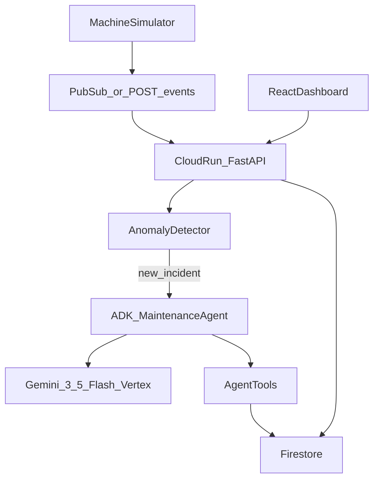

# Maintenance Agent

Autonomous industrial maintenance demo: simulated machines emit telemetry, simple code detects anomalies, and a Gemini agent (via Google ADK) investigates and decides what to do.

This is **not** a chatbot. The goal is an event-driven flow:

```text
telemetry → anomaly detection → incident → agent investigates → actions
```

## Architecture



Full component notes, closed-loop flow, and safety policy: [docs/architecture.md](docs/architecture.md).

## Hackathon submission

Track: **Taskmaster**. Paste-ready project description: [docs/SUBMISSION.md](docs/SUBMISSION.md). Demo video is recorded separately.

## What exists so far

### Phase 1 — AI agent foundation (needs Gemini / GCP)

A Google ADK agent with Gemini 3.5 Flash. You ask it to investigate PUMP-04; it calls tools and returns a maintenance decision.

### Phase 2 — Core domain (no AI)

Python models for machines, telemetry, incidents, work orders, and inventory, plus fake seed data and a **deterministic** anomaly detector (threshold checks, not ML).

If temperature / vibration / motor current exceed limits → create an incident and set machine status to `WARNING`.

### Phase 3 — Agent tools (needs Gemini / GCP)

The agent can independently call several tools against the domain store:

- `get_machine_context`
- `get_telemetry_history`
- `get_maintenance_history`
- `search_machine_manual`
- `check_inventory`
- `create_work_order`
- `update_machine_status`
- `notify_technician`
- `request_shutdown_approval` (CRITICAL only — human must approve)
- `resolve_incident` (after repair verification)

You still only prompt with something like `Investigate PUMP-04.` — Gemini chooses which tools to use.

### Phase 4 — Firestore persistence (needs GCP)

Domain data can be stored in Cloud Firestore instead of process memory.

Set `USE_FIRESTORE=true` in `backend/.env` so agent tools read/write Firestore. Restarting the backend then keeps machines, incidents, work orders, inventory, and agent actions.

### Phase 5 — Full incident workflow (needs Gemini / GCP)

Abnormal telemetry alone starts the agent — no manual «Investigate PUMP-04.» prompt.

Flow: telemetry → anomaly detector → new incident → ADK agent auto-runs → diagnosis / inventory / work order / notification.

### Phase 6 — Telemetry events (Pub/Sub push-ready)

Backend accepts telemetry on `POST /events/telemetry` (raw JSON or a Pub/Sub push envelope) and runs the Phase 5 workflow.

### Phase 7 — Frontend dashboard

React dashboard that shows fleet health, incident detail, agent activity timeline, work orders, and telemetry charts.

### Phase 8 — Closed loop

Technician marks a work order **completed** → healthy telemetry is written → agent verifies → incident becomes `RESOLVED` and machine returns to `HEALTHY`.

### Phase 9 — Safety / human approval

On **CRITICAL** severity the agent must call `request_shutdown_approval` — it never shuts down alone. Dashboard shows **Approve** / **Reject**: Approve sets the machine `OUT_OF_SERVICE`; Reject keeps `MAINTENANCE_REQUIRED`.

### Phase 10 — Cloud deployment

Backend + dashboard deploy to **Google Cloud Run** (same service). Firestore, Vertex AI (Gemini), and Pub/Sub push are wired in production. Push to `main` auto-deploys via GitHub Actions (Workload Identity).

Live service (project `maintenance-agent-hack`, region `europe-west1`):

https://maintenance-agent-786907268086.europe-west1.run.app

## Setup

```powershell
cd backend
python -m venv .venv
.venv\Scripts\Activate.ps1
pip install -r requirements.txt
copy .env.example .env
```

Edit `.env` and set `GOOGLE_CLOUD_PROJECT` to your GCP project ID.

Use location `eu` (or `global`) for `gemini-3.5-flash` — it is not available in `europe-west1`.

Authenticate with Application Default Credentials (needed for Gemini / Firestore):

```powershell
gcloud auth application-default login
gcloud config set project <PROJECT_ID>
```

Enable APIs (once per project):

```powershell
gcloud services enable aiplatform.googleapis.com firestore.googleapis.com --project <PROJECT_ID>
gcloud firestore databases create --database="(default)" --location=eur3 --type=firestore-native --project <PROJECT_ID>
```

Billing must be enabled on the project.

## Deploy to Cloud Run (Phase 10)

From the repo root (requires `gcloud` auth and billing):

```powershell
.\deploy\deploy-cloudrun.ps1
```

### Auto-deploy from GitHub (push to `main`)

One-time setup:

```powershell
$env:Path += ";$env:LOCALAPPDATA\Google\Cloud SDK\google-cloud-sdk\bin"
.\deploy\setup-github-actions.ps1
```

Add the two printed values as GitHub Actions secrets on the repo:

- `WIF_PROVIDER`
- `WIF_SERVICE_ACCOUNT`

(Repo → Settings → Secrets and variables → Actions)

After that, every push to `main` runs [`.github/workflows/deploy-cloudrun.yml`](.github/workflows/deploy-cloudrun.yml) and updates:

https://maintenance-agent-786907268086.europe-west1.run.app/

You can also trigger **Actions → Deploy to Cloud Run → Run workflow**.

Or manually:

```powershell
gcloud services enable run.googleapis.com cloudbuild.googleapis.com artifactregistry.googleapis.com --project maintenance-agent-hack

gcloud run deploy maintenance-agent `
  --source=. `
  --region=europe-west1 `
  --project=maintenance-agent-hack `
  --service-account=maintenance-agent-run@maintenance-agent-hack.iam.gserviceaccount.com `
  --allow-unauthenticated `
  --min-instances=0 `
  --max-instances=3 `
  --cpu=1 `
  --memory=1Gi `
  --timeout=300 `
  --set-env-vars="GOOGLE_GENAI_USE_VERTEXAI=TRUE,GOOGLE_CLOUD_PROJECT=maintenance-agent-hack,GOOGLE_CLOUD_LOCATION=eu,USE_FIRESTORE=true"
```

The image builds the React dashboard and serves it from FastAPI (`/`), with APIs under `/api` and telemetry at `POST /events/telemetry`.

Pub/Sub topic `machine-telemetry-events` pushes to the Cloud Run URL. Cloud Logging shows request and agent execution under the `maintenance-agent` service.

## Run tests (Phase 11)

From `backend/`:

```powershell
pip install -r requirements.txt
pytest
```

Tests use in-memory store only (no Firestore / Gemini). Agent calls are mocked.

## Run the API + dashboard

Terminal 1 — API (from `backend/`):

```powershell
uvicorn app.main:app --reload --port 8081
```

With `USE_FIRESTORE=true` in `.env`, state persists in Firestore. For a clean in-memory demo instead:

```powershell
$env:USE_FIRESTORE="false"
uvicorn app.main:app --reload --port 8081
```

(Use **8081** if 8080 is taken — e.g. by Apache/`httpd` on Windows.)

Terminal 2 — UI (from `frontend/`):

```powershell
npm install
npm run dev
```

Open `http://localhost:5173`.

- **Start simulator** → live fleet telemetry on all machines; random failure ramps trigger the agent
- **Load demo state** → incident page (severity, agent summary, timeline, work order)
- **Work orders** → **Mark as completed** (closed loop / Phase 8)
- **Load critical demo** → **Approvals** → Approve / Reject (Phase 9)

Vite proxies `/api` to `http://127.0.0.1:8081`.

With `USE_FIRESTORE=true`, startup ensures the full demo fleet exists (PUMP-04, CNC-02, FAN-01, CONV-03) even if Firestore already had a partial seed.

### Telemetry events

```powershell
# With API running:
# POST /events/telemetry with raw JSON or a Pub/Sub push envelope
```

### AI agent (optional)

From `backend/`:

```powershell
adk run maintenance_agent
```

Success prompt:

```text
Investigate PUMP-04.
```

Optional UI:

```powershell
adk web --port 8000
```

## Project layout

```text
docs/
  architecture.md        # Mermaid architecture + component notes
  SUBMISSION.md          # Paste-ready hackathon submission text
Dockerfile               # Multi-stage: frontend build + FastAPI for Cloud Run
.github/workflows/
  deploy-cloudrun.yml    # Auto-deploy to Cloud Run on push to main
deploy/
  deploy-cloudrun.ps1    # Manual: enable APIs, IAM, deploy, Pub/Sub push sub
  setup-github-actions.ps1  # One-time WIF + deploy SA for GitHub Actions
backend/
  maintenance_agent/     # ADK agent + tools
  app/
    models/
    store/               # MemoryStore + FirestoreStore
    services/            # anomaly, incident workflow, simulator, repair, ...
    api/                 # FastAPI: events, machines, incidents, simulator, demo, ...
    seed.py              # Fleet seed + ensure_fleet for Firestore
    main.py              # API + static dashboard in production
frontend/
  src/
    api/client.ts
    pages/               # Dashboard, Approvals, Incident, Machine, WorkOrders, Activity
    components/          # Layout, CriticalBanner, Timeline, Charts, StatusBadge
    styles/
```
