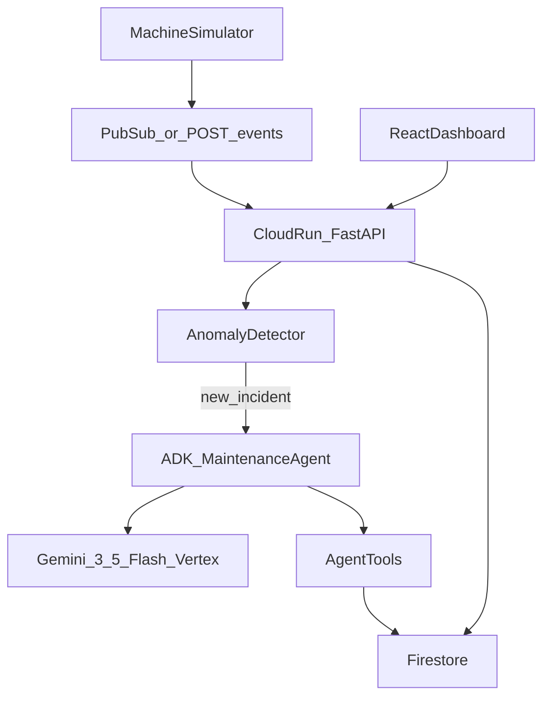

# Architecture

Maintenance Agent is an event-driven autonomous maintenance system. Simulated machines emit telemetry; a deterministic anomaly detector opens incidents; a Google ADK agent (Gemini 3.5 Flash on Vertex AI) investigates with tools and takes real actions. State lives in Firestore; the React dashboard is served from the same Cloud Run service as the FastAPI backend.

## System diagram

## Components

| Component | Role |
|-----------|------|
| **Machine simulator** | Emits temperature, vibration, and motor current for the demo fleet (e.g. PUMP-04). Can ramp toward failure or healthy values after repair. |
| **Pub/Sub / `POST /events/telemetry`** | Ingest path for telemetry. Production uses a Pub/Sub push subscription; local demos can POST JSON directly. |
| **Cloud Run + FastAPI** | Single service hosts the API, runs the anomaly detector and agent workflows, and serves the built React dashboard. |
| **Anomaly detector** | Deterministic threshold checks (not ML). On breach → create incident, update machine status, start the agent. |
| **ADK Maintenance Agent** | Google ADK agent with instructions and tools. Reasons with Gemini and chooses which tools to call. |
| **Gemini 3.5 Flash (Vertex AI)** | Model ID `gemini-3.5-flash`. Reasoning and tool-calling engine. |
| **Agent tools** | Read machine/telemetry/history/manual/inventory; create work orders; notify technician; update status; request shutdown approval; resolve incidents. |
| **Firestore** | Persistent store for machines, telemetry, incidents, work orders, inventory, approvals, and agent action logs. |
| **React dashboard** | Fleet health, incident detail, agent activity timeline, work orders, telemetry charts, and CRITICAL approve/reject. |

## Closed loop

1. Abnormal telemetry → anomaly → incident → agent investigates and acts (work order, notify, status).
2. Technician marks work order **completed** → healthy telemetry is written.
3. Agent verifies → `resolve_incident` → machine returns to `HEALTHY`.

## Safety (human-in-the-loop)

On **CRITICAL** severity the agent must call `request_shutdown_approval`. It never shuts down a machine alone. Dashboard **Approve** sets `OUT_OF_SERVICE`; **Reject** keeps `MAINTENANCE_REQUIRED`.

## Mandatory stack

- **Gemini 3.5 Flash** via Vertex AI
- **Google ADK**
- **Google Cloud:** Cloud Run, Firestore, Pub/Sub, Vertex AI

## Live deployment

Project `maintenance-agent-hack`, region `europe-west1`:

https://maintenance-agent-786907268086.europe-west1.run.app
